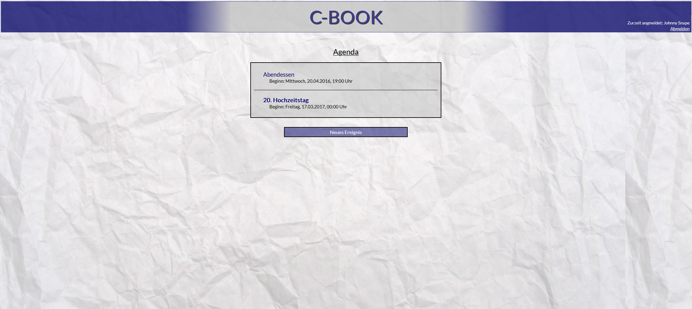

# C-Book

Das ist ein Informatik-Schulprojekt aus Q2. Diese Webanwendung ist ein Kalender, mit Nutzerverwaltung, Terminen und Teilnehmern.



## Voraussetzungen

Da diese Anwendung unter Ruby 2.x entwickelt worden ist, wird vorausgesetzt, dass diese (und nicht Ruby 3.x) vorhanden ist. Da neuere Systeme OpenSSL3 nutzen, ist die einzig nutzbare Version Ruby 2.7.8. Dies dann meist in Verbindung mit rbenv.

Zum Aufesetzen des Projektes muss dann folgendes ausgeführt werden, aus diesem Repo als CWD:
```bash
RUBY_BUILD_VENDOR_OPENSSL=1 rbenv install 2.7.8
rbenv local 2.7.8
bundle config set --local path vendor/bundle
bundle install
```

## Starten

Die Anwendung im Projektverzeichnis mit folgendem Befehl starten:

```bash
bundle exec ruby main.rb
```

C-Book started auf `http://localhost:4567`.
